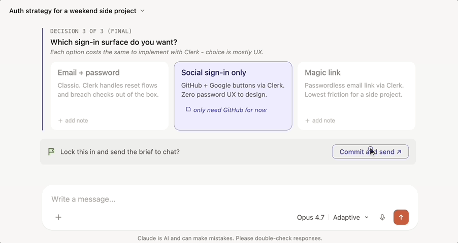
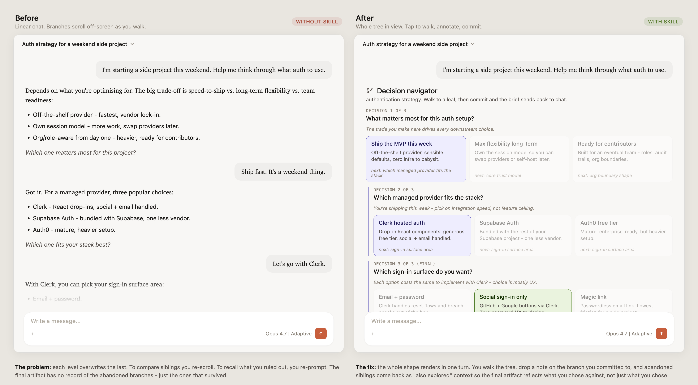

# decision-tree (Claude skill)

Walk a branching decision by tapping through an interactive tree instead of re-prompting Claude with _"wait, what was option 2 again?"_ every time you want to compare siblings. Tap a branch, drop a note on it, commit a leaf - Claude turns the committed path (plus the branches you ruled out) into an ADR, idea brief, itinerary, whatever the decision called for.

> [!NOTE]
> The widget renders in claude.ai (web) and Claude Desktop. Claude Code, `claude -p`, and the Anthropic API cannot invoke `visualize:show_widget`, so the skill no-ops there.

## In action

Three levels deep. One commit button. No re-scrolling to remember what you ruled out.

  

## Why this exists

  

Walking a strategic decision through chat means re-reading the same options five times, scrolling to compare branches, and losing your place when Claude reframes the question. _"Wait, which option were we on?"_

The decision-tree skill renders the whole shape at once. You see all top-level directions, drill into one, and back out to compare siblings without re-prompting. On commit, the committed path plus any branches you explored and abandoned go back to Claude as structured input - so the final artifact reflects what you actually chose against, not just what you chose.

## When it activates

The skill triggers on branching decisions where each top-level option leads somewhere genuinely different, not the same question with a filter swapped in. Three conditions hold before it renders.

**Decision variance.** Each top-level branch must lead to a different next-question, not the same question repeated. Claude runs this check internally before rendering - if the level-1 questions collapse to "give me N options in that style", the tree is abandoned and a flat list response comes back instead.

**Bounded structure.** 3 levels deep, 2-4 branches per level. Anything wider or deeper gets chunked or walked conversationally.

**Sufficient context.** Either you've primed the conversation, or one clarifying turn can fill the gap. The skill does not render cold.

Fits:

- _"Help me think through authentication for this side project."_
- _"I want to build a weekend side project. Help me figure out what."_
- _"How should we model variants in the document pair store?"_
- _"Plan a weekend trip from London."_

Does not fit:

- _"Help me name this side project."_ - same question with different stylistic filters
- _"Recommend a podcast about software engineering."_ - flat list, no branching
- _"Walk me through architecting a real-time collaborative editor."_ - cascading dependencies need real-time adaptation
- _"I don't know what I want to build."_ - no bounded structure yet, needs elicitation first
- _"I want to talk through this, not click buttons."_ - explicit request for conversation

## Install

1. Download [`decision-tree.zip`](https://github.com/jordanl17/claude-skill-decision-tree/releases/latest/download/decision-tree.zip) from the latest release.
2. Open [claude.ai/customize/skills](https://claude.ai/customize/skills) (or navigate via **Customize → Skills** in the left sidebar).
3. Click the **+** button, then **Create Skill** → **Upload a Skill**.
4. Select the `decision-tree.zip` file you downloaded.

The skill appears in your skills list once uploaded. Trigger it by asking for help with a branching decision (see [When it activates](#when-it-activates)).

### Build from source

If you want to install from a specific commit or modify the skill locally:

1. Clone this repo.
2. Run `pnpm install` then `pnpm build:zip`.
3. The resulting `decision-tree.zip` lands at the repo root and uploads via claude.ai the same way.

The archive contains a single `decision-tree/` folder at its root with `SKILL.md` and `assets/` inside.

## Limitations

- **claude.ai and Claude Desktop only.** Claude Code, `claude -p` (headless CLI), and the Anthropic API cannot invoke `visualize:show_widget`, which the skill depends on to render.
- **Tree is locked at render time.** The full tree generates upfront in one Claude turn, so notes dropped mid-walk feed the final artifact but cannot reshape downstream branches.
- **Depth and breadth caps.** 3 levels deep, 4 branches per level. Larger decision spaces have to be chunked or walked conversationally.
- **Variance gate.** Decisions where every top-level branch leads to the same follow-up question are filtered out before rendering - you'll get a flat list response instead.

## License

MIT. See [LICENSE](LICENSE).
